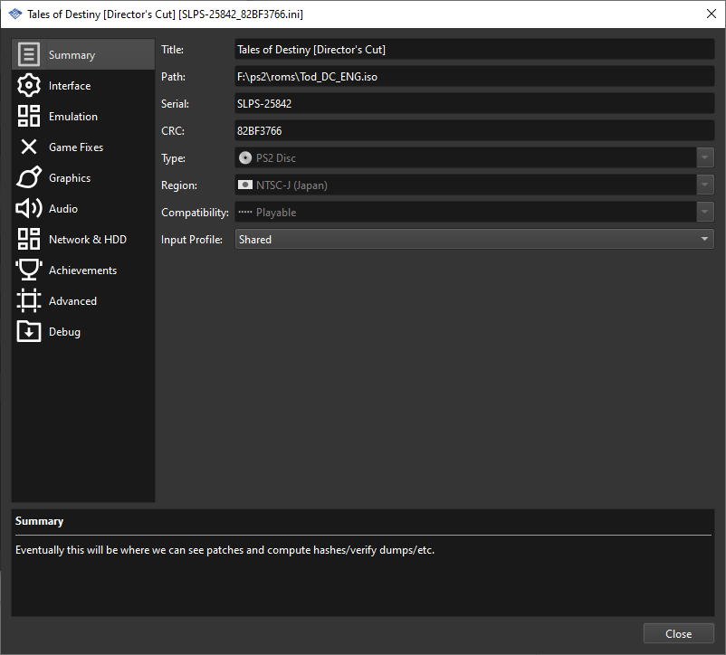

# bro?? how work

youll have to rename the pnach to the correct iso crc which you can view in the game properties here:

on QT specifically. on legacy pcsx2 versions do this: https://www.youtube.com/watch?v=lqM3gLumiYs

## Destiny DC
Double arte slots (from the random japanese guy from the dead website that was then posted on gamefaqs)

Switch narikiri doll arte slot page with triangle in bind menu

## Legendia
2 player multiplayer

60FPS (unlikely to run full speed)

## Destiny 2
All difficulties always unlocked

